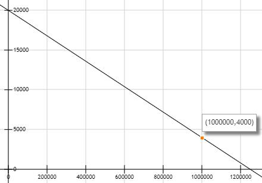
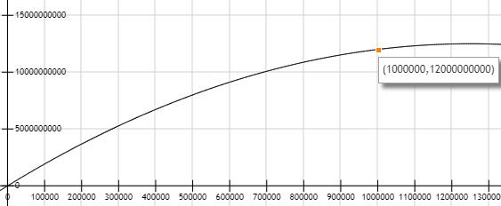

# CrossroadsCoin

CrossroadsCoin is a ERC-20 Token of ethereum, and it has some new feature: 1. exchanging ether and CRC implement by CRC contract; 2. automatically adjust the exchange rate by contract

## Contract Address

Ropsten test net: 0xd914Ea0778a66bF9a0856a26f1169DbDAF69ffA1, https://ropsten.etherscan.io/token/0xd914Ea0778a66bF9a0856a26f1169DbDAF69ffA1
Main net: 0xEc50DD65ec89fA3DEdA616717cDbf08a63Ff379F, https://etherscan.io/token/0xec50dd65ec89fa3deda616717cdbf08a63ff379f

## Features
   CrossroadsCoin(CRC) is a new token based ethereum, it meets the standards of ERC-20. In the others, it also has these
   features:
   1. Exchanging ether and CRC implement by CRC contract: one account could send ether to CRC contract to exchange CRC,
    the totalSupply of CRC increased until supply reach to CRC upper limits, 1 million; in the meanwhile, you can send CRC
    to CRC contract to redeem ether, the CRC you sent will be destroyed and the CRC totalSupply will decrease;
   2. Automatically adjust the exchange rate by contract: The exchange ratio of CRC decreases with the increase of 
   total supply, the supply-demand relationship of CRC and exchange rate reference to [Exchange Rate](#Exchange Rate).
   
## Exchange Rate
   Main principles of CRC contract is: 
    The independent variable x is used to represent the number of ether converted, and the dependent variable y is
     used to represent the total supply 
   1. Firstly, exchange rate decreases with the increase of total supply. We defined three constant variable: 
   destEtherNum, iniRate and minRate, they represent respectively the raise upper limits ether, initial exchange rate(
   while raised ether num is 0) and minimum exchange rate, the iniRate should be greater than minRate. Then, we defined 
   rate(x) = iniRate – x / k, rate(x) represent the exchange rate curve. Used {x = destEtherNum, rate(x) = minRate} to 
   figure out k, the value of k is k = destEtherNum / (iniRate - minRate). In the CRC contract, iniRate set to 20000, 
   minRate set to 4000 and destEtherNum set to 1 million(1000000), so k=62.5, rate(x) = 20000 - x / 62.5. The image of 
   exchange rate curve is:
   
   
   2. Secondly, we can calculate the relationship of totalSupply and raised ether num as we got rate(x) curve. Obviously,
   totalSupply is calculus of rate(x). So, the finally relationship of y and x is y= iniRate\*x- x^2/(2\*k), the example
   image is:
   
   
## Exchange Fee
   Exchange CRC and redeem ether should pay a certain percentage of the handling fee. It is defined by CRC contract, the
   value is 1/10000 and it is can't adjust.
   
## Donate
   The ETH address of development is 0x60482a3dF6E9b0b268888f095E8A615680db47bE, thanks for you encouragement.
