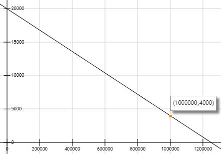
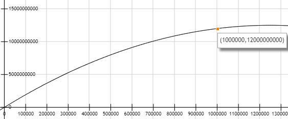

# 歧路币

[English](README.md) | 中文

歧路币是基于Ethereum的一种新的代币，它符合ERC-20标准, 它还具有如下特性：
1. 由合约实现的自动兑换和赎回；
2. 由合约自动调节兑换比例；
## 合约地址

Ropsten test net: 0xd914Ea0778a66bF9a0856a26f1169DbDAF69ffA1, https://ropsten.etherscan.io/token/0xd914Ea0778a66bF9a0856a26f1169DbDAF69ffA1

Main net: 0xEc50DD65ec89fA3DEdA616717cDbf08a63Ff379F, https://etherscan.io/token/0xec50dd65ec89fa3deda616717cdbf08a63ff379f

## 特性
  歧路币是基于Ethereum的一种新的代币，它符合ERC-20标准，能够在Ethereum账户之间自由转移，同时，它具有如下特性：
    1. 由合约实现的自动兑换和赎回：用户可以通过将ETH发送到合约地址的方式兑换歧路币，这时歧路币的总供应量会上升，直到达到
    上限100万个ETH；同时，用户可以将歧路币发送到合约地址，赎回ETH，这时发送到合约地址的歧路币将会被销毁，总供应量将会下降；
    2. 由合约自动调节兑换比例：歧路币的兑换比例随着总供应量的上升而下降，以此调节歧路币的供求关系，减少通胀，调节关系参考
    [兑换比例](#兑换比例)；

## 兑换比例
  歧路币合约实现了自动兑换和兑换比例调节的功能，主要原理如下：
    使用自变量x代表兑换的ether的数量，因变量y代表歧路币的总发行量totalSupply；
   1. 首先，兑换比例随总供应量的升高而下降，这里定义三个常量： destEtherNum， iniRate和minRate，分别代表token要筹集
   ether的上限，当x为零时的兑换比例，当x达到筹集上限时的兑换比例。其中，iniRate和minRate需满足iniRate > minRate。
   这里定义rate(x) = iniRate – x / k；将destEtherNum和minRate代入，得minRate = iniRate – destEtherNum / k，
   解得k = destEtherNum / (iniRate - minRate)。合约中设置的destEtherNum，iniRate和minRate的值分别为1000000，
   20000，4000，所以k = 62.5，rate(x) = 20000 - x / 62.5 (0 <= x <= 1000000)，兑换比例曲线的示意图如下：
    
    
   2. 其次，有了rate(x)的曲线之后，就可以计算代币发行量y与筹集ether个数x的关系，很明显的是，y是rate(x)的积分函数，最终
    的计算结果为y= iniRate\*x- x^2/(2\*k) (0 <= x <= 1000000)，如下图：
    
    
## 手续费
   歧路币的兑换和赎回需要支付一定比例的手续费，合约中定义的是万分之一，不可调整，这由合约实现。
   
## 捐赠
   开发者的ETH地址为0x60482a3dF6E9b0b268888f095E8A615680db47bE。
